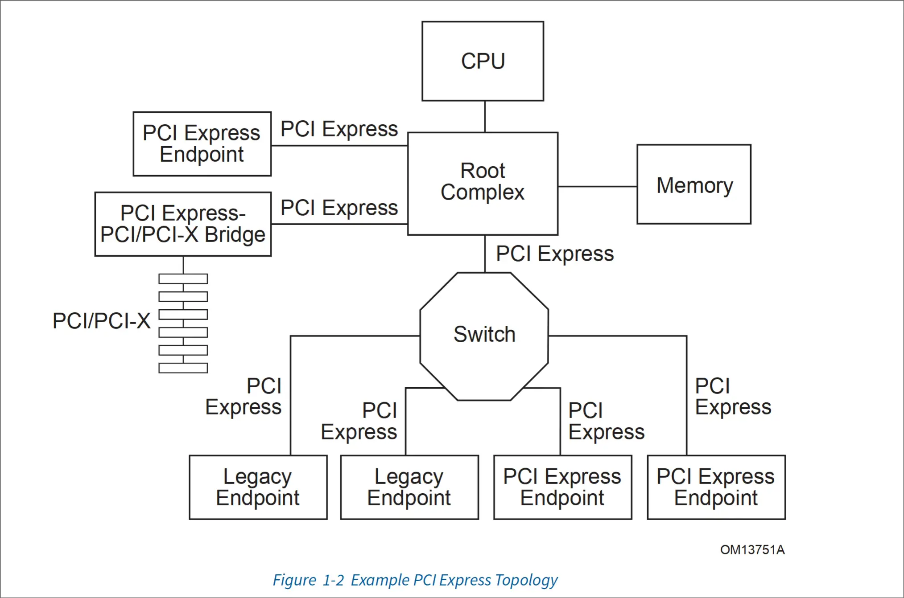
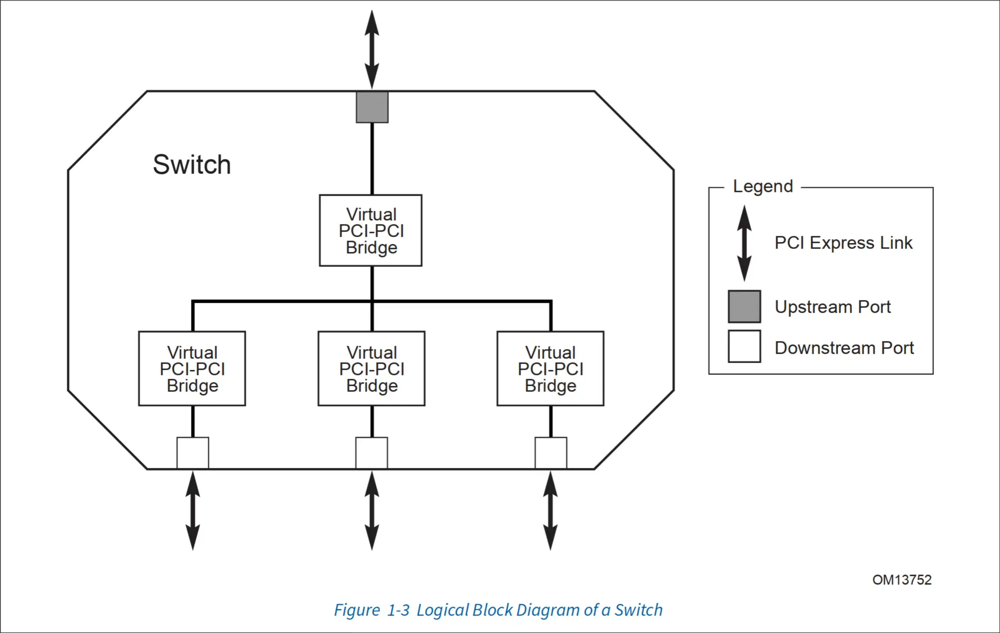
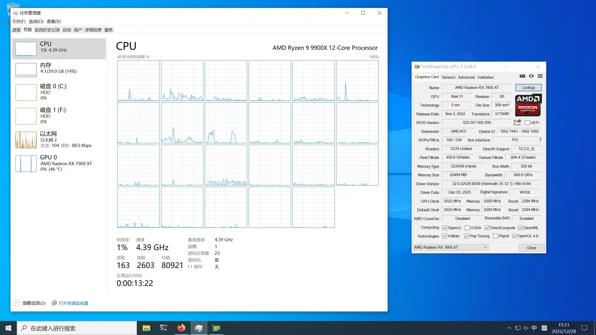
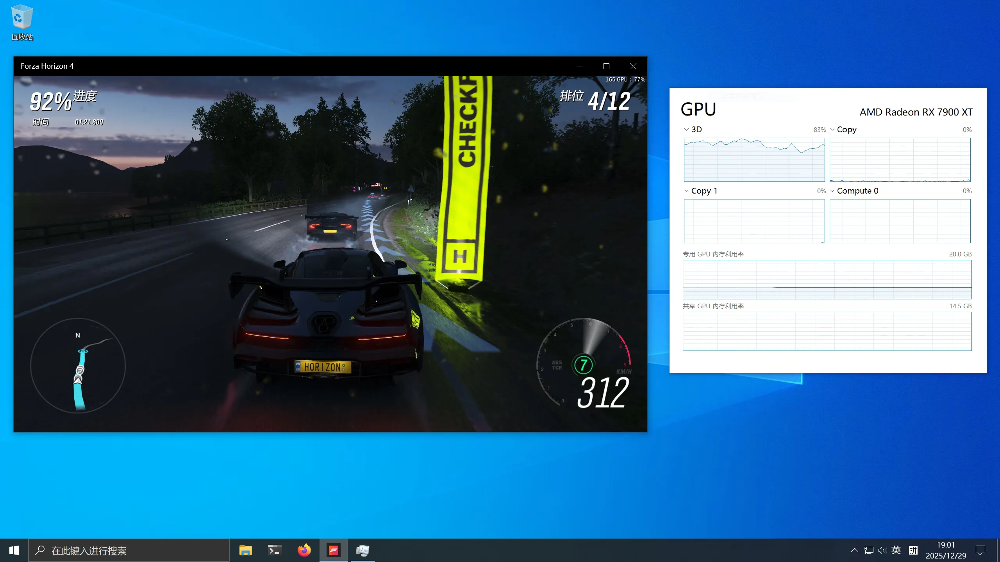
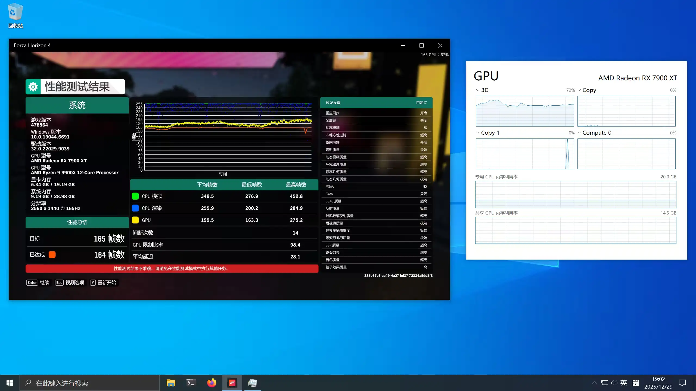

+++
date = '2025-12-31T18:25:01+08:00'
title = 'QEMU/VFIO: Windows Guest 折腾记录'

tags = ['Linux', 'QEMU', 'Windows', 'VFIO', 'PCIe']
categories = ['Linux']
image = 'cover.webp'
+++

## 前言
由于小时候不懂事在沟槽的 Microsoft Store 上买了个 Horizon 4，以及 Linux (Wayland) 上一直缺乏一个好用的 Office 软件，
一直想搭建一个体验如同真机的 Windows 虚拟机，即开机接管所有外围设备并直接进入 Windows，关机也会将整台电脑一起关闭。

你说为什么不 Dual Boot 🧐？

Hummm... 答案是现在应该（大概？）没有人能够将 Windows 直接安装在一个 LVM 的 logic volume 上吧：
```
NAME               FSTYPE      LABEL   SIZE FSAVAIL FSUSE% MOUNTPOINTS
sda                                  931.5G                
└─sda1             LVM2_member       931.5G                
  ├─Data-steamos   btrfs               512G                
  ├─Data-private   crypto_LUKS          80G                
  ├─Data-secrets   crypto_LUKS           4G                
  ├─Data-windows                       256G                
  └─Data-ventoy    btrfs                64G                
nvme1n1                              476.9G                
└─nvme1n1p1        LVM2_member       476.9G                
  ├─Home-archlinux btrfs               208G   77.6G    61% /home
  ├─Home-steamos   btrfs                64G                
  └─Home-windows   btrfs                64G                
nvme0n1                              232.9G                
├─nvme0n1p1        vfat        EFI       6G    5.8G     3% /efi
└─nvme0n1p2        LVM2_member       226.9G                
  ├─Root-swap      swap                 32G                [SWAP]
  ├─Root-archlinux btrfs                80G   50.5G    36% /
  ├─Root-steamos   btrfs                64G                
  └─Root-windows   btrfs                 4G                
```
~~三块盘完美符合 Memory Hierarchy~~<br>
在这种磁盘布局下很难在不失灵活性的同时单独安装 Windows。

在继续之前先对照一下平台配置：
- CPU: AMD Ryzen 9 9900X (24)
- 主板: ROG STRIX B850-I GAMING WIFI
- iGPU: AMD Granite Ridge [Radeon Graphics]
- dGPU: AMD Radeon RX 7900 XT
- Firmware: 1402 Wed 2025-11-12, AGESA 1.2.7.0
- Kernel: 6.18.2

需要注意的是不同的板U组合对后续直通的影响很大，同时 RX 7000 系的显卡会有很多 quirks，导致直通流程与一般的显卡不太一样。

## 一些说明
我在接下来的步骤中将会直接使用 QEMU command line 启动虚拟机。

为什么不使用 libvirt？用过，感觉很烂。这玩意对个人用户纯纯 overkill：
- XML？请输入文本。
- Bloating，装完之后系统中多了一堆没用的用户/用户组和服务。
- 极难调试，喜欢我虚拟机启动后把你的配置文件给改了吗？

VFIO PCI 设备直通和硬件平台本身的联系非常密切，请一定根据**你的硬件配置**选择应该采用哪些步骤、如何配置。

如果你是按照我接下来的方法配置的 Windows Guest，请**绝对不要**在 Windows 中开启内核隔离/Hyper-V 等依赖虚拟化的功能，
否则重启后可能会卡在启动界面无法进入 Greeter。~~如果你能在 WinRE 中挂载分区修改注册表那可以试试~~

虽然虚拟机到最后确实是跑在一个 headless 的 ArchLinux 上的，但是在安装 Windows 时由于没有显卡驱动所以可能需要使用 QEMU 的图形后端
（如 GTK, VNC）来显示 VGA 输出。

我这边是在另一个系统的桌面环境上安装配置完成后再迁移到目标系统的，当然在目标系统上安装图形环境后再卸载也是可行的。

然后在配置，安装和调试 Windows 的系统上需要安装以下工具：
```bash
sudo pacman -S networkmanager dnsmasq qemu-img qemu-system-x86 qemu-ui-gtk swtpm usbutils virt-firmware
```

**Hints:**
- 查看 ArchWiki 时最好查看其英文页面，ArchWikiCN 的翻译可能会有些许滞后和缺失。
- 除了可以使用 `man qemu` 查看整体的文档外，如果想查看某个选项/设备的参数可以使用 `qemu-system-x86_64 xxx,help`。
比如使用 `qemu-system-x86_64 -device vfio-pci,help` 查看该设备接受的参数。

## CPU 和芯片组
先配置基本的 CPU，内存和芯片组：
```bash
# Machine
-name windows
-machine q35,vmport=off,smm=on
-accel kvm

# SMP
-cpu "host,kvm=off,topoext=on,svm=on,hypervisor=on,${hyperv_opts_str}"
-smp 23,sockets=1,cores=23,threads=1
-m 29G
```
其中 `hyprv_opts_str` 如下：
```bash
# Hyper-V Enlightenments
hyperv_opts=(
    hv_relaxed
    hv_vapic
    hv_spinlocks=0xfff
    hv_vpindex
    hv_synic
    hv_time
    hv_stimer
    hv_tlbflush
    hv_tlbflush_ext
    hv_ipi
    hv_stimer_direct
    hv_runtime
    hv_frequencies
    hv_reenlightenment
    hv_avic
    hv_xmm_input
    hv_vendor_id=0123456789ab
)
hyperv_opts_str=$(IFS=,; echo "${hyperv_opts[*]}")
```
想使用 VFIO 功能芯片组只能用 Q35，没的选，不加版本号默认就是最新的。`smm` 似乎 Windows 能用上，遂开启。
`vmport` 用于模拟 VMWare 的 IO Port，作用不明。

CPU 这边则是直通宿主机的即可，`topoext` 用于在 AMD CPU 上开启 SMT，不开会报错。剩下的 `svm`, `hyperv...` 据说可以提升
Windows 的性能。CPU 拓扑和内存如果没有什么性能需求随便分配即可，这边留了 1C1G 给 Linux hypervisor。

如果你是经验丰富的 VFIO 玩家，那你可能已经注意到这边对客户机的显卡驱动隐藏了虚拟化。不过按理说 AMD 不会像隔壁一样禁止
你在虚拟机里用他的 GPU，那是什么原因呢 🤔？留到[显卡直通](#gpu-直通)的时候再讲好了（

**Hints:**
- 根据 ArchWiki，自 Windows 10 1803 版本及以后需要在配置内核模块参数 `kvm.ignore_msrs=1` 和 `kvm.report_ignored_msrs=0`
以防止蓝屏。但在我这边暂未出现该情况，如有需要可以添加。

## UEFI 和 TPM2
虽然我只打算装 Windows 10 IoT，但鬼知道哪天 MICRO$OFT 会不会发病让你强制升级 Windows 11。如果要装 Windows 11 的话 TPM 2.0 最好
还是打开，不然就算装上去了更新也很麻烦。

使用 `swtpm` 模拟 TPM 2.0：
```bash
swtpm socket                                              \
  --tpm2                                                  \
  --tpmstate dir="${HOME}/firmware"                       \
  --ctrl type=unixio,path="${XDG_RUNTIME_DIR}/tpm_sock"
```
传递给 `swtpm` 的目录必须存在，`swtpm` 不会自己创建。

QEMU 中的设置：
```bash
# Firmware
-drive if=pflash,format=raw,readonly=on,file=/usr/share/edk2/x64/OVMF_CODE.secboot.4m.fd
-drive if=pflash,format=raw,file="$HOME/firmware/nvram.fd"
-fw_cfg name=opt/ovmf/X-PciMmio64Mb,string=65536
-global ICH9-LPC.disable_s3=1
-global ICH9-LPC.disable_s4=1
-boot menu=on,strict=on,reboot-timeout=2000
-rtc base=localtime

# TPM2
-chardev socket,id=ch0,path="$XDG_RUNTIME_DIR/tpm_sock"
-tpmdev emulator,id=tpm0,chardev=ch0
-device tpm-tis,tpmdev=tpm0
```
前两行指定了 UEFI 固件和存储设置的 NVRAM 文件。如果你希望使用 Secure Boot，那么第一个 UEFI 固件必须选择带 "secboot" 字样的文件，
这个在不同发行版之间的名字差别不大。但对于第二个 NVRAM 模板文件，不同发行版之间的差异较大。如果你是 ArchLinux 用户，
那么请参阅后面的[安全启动](#安全启动)这一小节；如果你使用 Fedora，那么应该能够找到一个 enroll 了微软证书的 secboot NVRAM 模板，
直接拷贝后使用即可开启 Secure Boot。

`fw_cfg` 打开固件对于大于 4G 地址空间的解码支持，EDK2 面板中没有提供此入口，用于下文的显卡直通，不过目前感觉没啥卵用。

接下来的几行关闭了系统对于 suspend (S3) 和 hibernate (S4) 的支持以防 Windows 睡死，并将客户机的 RTC 置为 localtime。

## PCIe 拓扑
本来只是想着能把设备连上就行，结果中间出了一堆问题，因此在解决问题的同时顺便学习了一下 PCIe。

### PCIe 简介
PCIe 是现代消费级计算机中唯一的内部高速总线，负责连接 CPU 与几乎所有的外围设备，甚至连接 CPU 与 CPU 内部的各种功能。

PCIe 是从 PCI 这个并行总线演化而来的，在软件配置上完全兼容 PCI，因此在编写软件时，一般都直接称 PCIe 设备为 PCI 设备。

我们先来看一下 PCIe 的地址格式，BDF，即 Bus:Device.Function：
```
0000:BB:DD.F
0000:0f:00.2
```
1. 前面的这个 `0000` 是什么？这个是 Domain 编号，在一般的消费级系统中只有一个 Domain，即 Domain0。
2. Bus 这个概念则是从 PCI 总线中借用过来的。在传统的 PCI 中，多个设备共享同一个总线并需要进行总线仲裁。
然而 PCIe 虽然叫总线，但其使用的是串行点对点通信而非 PCI 的并行共享总线的通信方式。因此大多情况下即使在同一个 Bus 下的设备
都是完全隔离的。所以逻辑上其实也可以像 PCI 那样将其当作从上游引出的物理连接来理解。
3. Device，没啥好说的，就是给总线上插着的设备编个号，不一定是连续的。不过基本上都是一个 Bus 只连接一个 Device，
除了下面的 multifunction。
4. Function 出现的原因是一个物理 PCI 设备可能不止一个功能，~~比如用显卡给手机充电~~ 其每个功能都可以作为一个独立的 PCI 设备工作。
因此使用这个 Function Number 区分不同的功能。

接下来看一下 PCIe 的拓扑结构：




在一个纯 PCIe 环境中，应该只有三种设备：Root Complex (RC)，PCIe Switch 和 Endpoint Device：
- RC 是整个 PCIe 拓扑的起始点，所有的下游设备都要连接到 RC 的端口上，也称为 PCIe Root Port，即根端口。RC 并不是一个具体的硬件，
而只是一个逻辑上的概念：只要你能够满足标准规定，你在里面想怎么连，有多少个设备都可以。同时，一个系统中可以有多个 RC，
而一个 RC 通常会有多个 Root Port 以便扩展。一个系统中的 RC 下的设备一般都出现在 Bus0，即根总线上。
- PCIe Switch 跟计算机网络中的交换机的作用和工作流程都非常相似，在这里其作用就是将一个来自上游的 PCI Bus 扩展为
若干个下游的 PCI Bus。连接上游总线的端口为 Upstream Port，拓展出的端口就是 Downstream Port。
- Endpoint Device 就是实现最终外设功能的 PCI 设备，比如显卡、网卡、USB 控制器等。对于 multifunction 的设备，
每个 function 都是一个 endpoint。

下面以我系统中的 PCIe 拓扑为例：
```
-[0000:00]-+-00.0  Advanced Micro Devices, Inc. [AMD] Raphael/Granite Ridge Root Complex [1022:14d8]
           +-00.2  Advanced Micro Devices, Inc. [AMD] Raphael/Granite Ridge IOMMU [1022:14d9]
           +-01.0  Advanced Micro Devices, Inc. [AMD] Raphael/Granite Ridge Dummy Host Bridge [1022:14da]
           +-01.1-[01-03]----00.0-[02-03]----00.0-[03]--+-00.0  Advanced Micro Devices, Inc. [AMD/ATI] Navi 31 [Radeon RX 7900 XT/7900 XTX/7900 GRE/7900M] [1002:744c]
           |                                            +-00.1  Advanced Micro Devices, Inc. [AMD/ATI] Navi 31 HDMI/DP Audio [1002:ab30]
           |                                            +-00.2  Advanced Micro Devices, Inc. [AMD/ATI] Navi 31 USB [1002:7446]
           |                                            \-00.3  Advanced Micro Devices, Inc. [AMD/ATI] Device [1002:7444]
           +-01.2-[04]----00.0  Samsung Electronics Co Ltd NVMe SSD Controller PM9A1/PM9A3/980PRO [144d:a80a]
           +-02.0  Advanced Micro Devices, Inc. [AMD] Raphael/Granite Ridge Dummy Host Bridge [1022:14da]
           +-02.1-[05-0d]----00.0-[06-0d]--+-00.0-[07]--
           |                               +-08.0-[08]--
           |                               +-09.0-[09]--
           |                               +-0a.0-[0a]----00.0  Intel Corporation Ethernet Controller I226-V [8086:125c]
           |                               +-0b.0-[0b]----00.0  MEDIATEK Corp. MT7925 802.11be 160MHz 2x2 PCIe Wireless Network Adapter [Filogic 360] [14c3:7925]
           |                               +-0c.0-[0c]----00.0  Advanced Micro Devices, Inc. [AMD] 800 Series Chipset USB 3.x XHCI Controller [1022:43fc]
           |                               \-0d.0-[0d]----00.0  Advanced Micro Devices, Inc. [AMD] 600 Series Chipset SATA Controller [1022:43f6]
           +-02.2-[0e]----00.0  Phison Electronics Corporation E12 NVMe Controller [1987:5012]
           +-03.0  Advanced Micro Devices, Inc. [AMD] Raphael/Granite Ridge Dummy Host Bridge [1022:14da]
           +-04.0  Advanced Micro Devices, Inc. [AMD] Raphael/Granite Ridge Dummy Host Bridge [1022:14da]
           +-08.0  Advanced Micro Devices, Inc. [AMD] Raphael/Granite Ridge Dummy Host Bridge [1022:14da]
           +-08.1-[0f]--+-00.0  Advanced Micro Devices, Inc. [AMD/ATI] Granite Ridge [Radeon Graphics] [1002:13c0]
           |            +-00.1  Advanced Micro Devices, Inc. [AMD/ATI] Radeon High Definition Audio Controller [1002:1640]
           |            +-00.2  Advanced Micro Devices, Inc. [AMD] Family 19h PSP/CCP [1022:1649]
           |            +-00.3  Advanced Micro Devices, Inc. [AMD] Raphael/Granite Ridge USB 3.1 xHCI [1022:15b6]
           |            \-00.4  Advanced Micro Devices, Inc. [AMD] Raphael/Granite Ridge USB 3.1 xHCI [1022:15b7]
           +-08.3-[10]----00.0  Advanced Micro Devices, Inc. [AMD] Raphael/Granite Ridge USB 2.0 xHCI [1022:15b8]
           +-14.0  Advanced Micro Devices, Inc. [AMD] FCH SMBus Controller [1022:790b]
           +-14.3  Advanced Micro Devices, Inc. [AMD] FCH LPC Bridge [1022:790e]
           +-18.0  Advanced Micro Devices, Inc. [AMD] Raphael/Granite Ridge Data Fabric; Function 0 [1022:14e0]
           +-18.1  Advanced Micro Devices, Inc. [AMD] Raphael/Granite Ridge Data Fabric; Function 1 [1022:14e1]
           +-18.2  Advanced Micro Devices, Inc. [AMD] Raphael/Granite Ridge Data Fabric; Function 2 [1022:14e2]
           +-18.3  Advanced Micro Devices, Inc. [AMD] Raphael/Granite Ridge Data Fabric; Function 3 [1022:14e3]
           +-18.4  Advanced Micro Devices, Inc. [AMD] Raphael/Granite Ridge Data Fabric; Function 4 [1022:14e4]
           +-18.5  Advanced Micro Devices, Inc. [AMD] Raphael/Granite Ridge Data Fabric; Function 5 [1022:14e5]
           +-18.6  Advanced Micro Devices, Inc. [AMD] Raphael/Granite Ridge Data Fabric; Function 6 [1022:14e6]
           \-18.7  Advanced Micro Devices, Inc. [AMD] Raphael/Granite Ridge Data Fabric; Function 7 [1022:14e7]
```
```
00:00.0 Host bridge [0600]: Advanced Micro Devices, Inc. [AMD] Raphael/Granite Ridge Root Complex [1022:14d8]
00:00.2 IOMMU [0806]: Advanced Micro Devices, Inc. [AMD] Raphael/Granite Ridge IOMMU [1022:14d9]
00:01.0 Host bridge [0600]: Advanced Micro Devices, Inc. [AMD] Raphael/Granite Ridge Dummy Host Bridge [1022:14da]
00:01.1 PCI bridge [0604]: Advanced Micro Devices, Inc. [AMD] Raphael/Granite Ridge GPP Bridge [1022:14db]
00:01.2 PCI bridge [0604]: Advanced Micro Devices, Inc. [AMD] Raphael/Granite Ridge GPP Bridge [1022:14db]
00:02.0 Host bridge [0600]: Advanced Micro Devices, Inc. [AMD] Raphael/Granite Ridge Dummy Host Bridge [1022:14da]
00:02.1 PCI bridge [0604]: Advanced Micro Devices, Inc. [AMD] Raphael/Granite Ridge GPP Bridge [1022:14db]
00:02.2 PCI bridge [0604]: Advanced Micro Devices, Inc. [AMD] Raphael/Granite Ridge GPP Bridge [1022:14db]
00:03.0 Host bridge [0600]: Advanced Micro Devices, Inc. [AMD] Raphael/Granite Ridge Dummy Host Bridge [1022:14da]
00:04.0 Host bridge [0600]: Advanced Micro Devices, Inc. [AMD] Raphael/Granite Ridge Dummy Host Bridge [1022:14da]
00:08.0 Host bridge [0600]: Advanced Micro Devices, Inc. [AMD] Raphael/Granite Ridge Dummy Host Bridge [1022:14da]
00:08.1 PCI bridge [0604]: Advanced Micro Devices, Inc. [AMD] Raphael/Granite Ridge Internal GPP Bridge to Bus [C:A] [1022:14dd]
00:08.3 PCI bridge [0604]: Advanced Micro Devices, Inc. [AMD] Raphael/Granite Ridge Internal GPP Bridge to Bus [C:A] [1022:14dd]
00:14.0 SMBus [0c05]: Advanced Micro Devices, Inc. [AMD] FCH SMBus Controller [1022:790b] (rev 71)
00:14.3 ISA bridge [0601]: Advanced Micro Devices, Inc. [AMD] FCH LPC Bridge [1022:790e] (rev 51)
00:18.0 Host bridge [0600]: Advanced Micro Devices, Inc. [AMD] Raphael/Granite Ridge Data Fabric; Function 0 [1022:14e0]
00:18.1 Host bridge [0600]: Advanced Micro Devices, Inc. [AMD] Raphael/Granite Ridge Data Fabric; Function 1 [1022:14e1]
00:18.2 Host bridge [0600]: Advanced Micro Devices, Inc. [AMD] Raphael/Granite Ridge Data Fabric; Function 2 [1022:14e2]
00:18.3 Host bridge [0600]: Advanced Micro Devices, Inc. [AMD] Raphael/Granite Ridge Data Fabric; Function 3 [1022:14e3]
00:18.4 Host bridge [0600]: Advanced Micro Devices, Inc. [AMD] Raphael/Granite Ridge Data Fabric; Function 4 [1022:14e4]
00:18.5 Host bridge [0600]: Advanced Micro Devices, Inc. [AMD] Raphael/Granite Ridge Data Fabric; Function 5 [1022:14e5]
00:18.6 Host bridge [0600]: Advanced Micro Devices, Inc. [AMD] Raphael/Granite Ridge Data Fabric; Function 6 [1022:14e6]
00:18.7 Host bridge [0600]: Advanced Micro Devices, Inc. [AMD] Raphael/Granite Ridge Data Fabric; Function 7 [1022:14e7]
01:00.0 PCI bridge [0604]: Advanced Micro Devices, Inc. [AMD/ATI] Navi 10 XL Upstream Port of PCI Express Switch [1002:1478] (rev 10)
02:00.0 PCI bridge [0604]: Advanced Micro Devices, Inc. [AMD/ATI] Navi 10 XL Downstream Port of PCI Express Switch [1002:1479] (rev 10)
03:00.0 VGA compatible controller [0300]: Advanced Micro Devices, Inc. [AMD/ATI] Navi 31 [Radeon RX 7900 XT/7900 XTX/7900 GRE/7900M] [1002:744c] (rev cc)
03:00.1 Audio device [0403]: Advanced Micro Devices, Inc. [AMD/ATI] Navi 31 HDMI/DP Audio [1002:ab30]
03:00.2 USB controller [0c03]: Advanced Micro Devices, Inc. [AMD/ATI] Navi 31 USB [1002:7446]
03:00.3 Serial bus controller [0c80]: Advanced Micro Devices, Inc. [AMD/ATI] Device [1002:7444]
04:00.0 Non-Volatile memory controller [0108]: Samsung Electronics Co Ltd NVMe SSD Controller PM9A1/PM9A3/980PRO [144d:a80a]
05:00.0 PCI bridge [0604]: Advanced Micro Devices, Inc. [AMD] 600 Series Chipset PCIe Switch Upstream Port [1022:43f4] (rev 01)
06:00.0 PCI bridge [0604]: Advanced Micro Devices, Inc. [AMD] 600 Series Chipset PCIe Switch Downstream Port [1022:43f5] (rev 01)
06:08.0 PCI bridge [0604]: Advanced Micro Devices, Inc. [AMD] 600 Series Chipset PCIe Switch Downstream Port [1022:43f5] (rev 01)
06:09.0 PCI bridge [0604]: Advanced Micro Devices, Inc. [AMD] 600 Series Chipset PCIe Switch Downstream Port [1022:43f5] (rev 01)
06:0a.0 PCI bridge [0604]: Advanced Micro Devices, Inc. [AMD] 600 Series Chipset PCIe Switch Downstream Port [1022:43f5] (rev 01)
06:0b.0 PCI bridge [0604]: Advanced Micro Devices, Inc. [AMD] 600 Series Chipset PCIe Switch Downstream Port [1022:43f5] (rev 01)
06:0c.0 PCI bridge [0604]: Advanced Micro Devices, Inc. [AMD] 600 Series Chipset PCIe Switch Downstream Port [1022:43f5] (rev 01)
06:0d.0 PCI bridge [0604]: Advanced Micro Devices, Inc. [AMD] 600 Series Chipset PCIe Switch Downstream Port [1022:43f5] (rev 01)
0a:00.0 Ethernet controller [0200]: Intel Corporation Ethernet Controller I226-V [8086:125c] (rev 06)
0b:00.0 Network controller [0280]: MEDIATEK Corp. MT7925 802.11be 160MHz 2x2 PCIe Wireless Network Adapter [Filogic 360] [14c3:7925]
0c:00.0 USB controller [0c03]: Advanced Micro Devices, Inc. [AMD] 800 Series Chipset USB 3.x XHCI Controller [1022:43fc] (rev 01)
0d:00.0 SATA controller [0106]: Advanced Micro Devices, Inc. [AMD] 600 Series Chipset SATA Controller [1022:43f6] (rev 01)
0e:00.0 Non-Volatile memory controller [0108]: Phison Electronics Corporation E12 NVMe Controller [1987:5012] (rev 01)
0f:00.0 VGA compatible controller [0300]: Advanced Micro Devices, Inc. [AMD/ATI] Granite Ridge [Radeon Graphics] [1002:13c0] (rev c2)
0f:00.1 Audio device [0403]: Advanced Micro Devices, Inc. [AMD/ATI] Radeon High Definition Audio Controller [1002:1640]
0f:00.2 Encryption controller [1080]: Advanced Micro Devices, Inc. [AMD] Family 19h PSP/CCP [1022:1649]
0f:00.3 USB controller [0c03]: Advanced Micro Devices, Inc. [AMD] Raphael/Granite Ridge USB 3.1 xHCI [1022:15b6]
0f:00.4 USB controller [0c03]: Advanced Micro Devices, Inc. [AMD] Raphael/Granite Ridge USB 3.1 xHCI [1022:15b7]
10:00.0 USB controller [0c03]: Advanced Micro Devices, Inc. [AMD] Raphael/Granite Ridge USB 2.0 xHCI [1022:15b8]
```
可以看到所有的拓扑都是从根总线 `0000:00` 开始的。然后在其上面连接的是 CPU 内部的各种设备，例如 Data Fabric, XXX Bridge, SMBus
控制器等。注意有缩进的地方并不是直接连接在根总线上的，而是连接到了 GPP Bridge 的下游端口上。这一大堆直接连接到根总线上的设备
就组成了这个系统的 RC。尽管这些设备可以被 `lspci` 列出，但这些设备并不一定是 PCI 设备，可能使用了其他片上互联的方式，
只是暴露了 PCI 接口供内核进行管理。那 RC 的 Root Port 在哪里呢？稍加观察可以发现所有的外围设备都是从 GPP Bridge 引出的，
因此这个 GPP Bridge 就是 RC 的根端口。

这里有必要说明一下什么是 bridge。Bridge 就是将两个不同总线连接到一起的设备，这两个总线可以是不同类型的，比如 PCIe 和 LPC；
也可以是相同类型的，比如 PCIe 和 PCIe ，也就是 PCIe Switch。所以 bridge 还有一个重要作用就是扩展已有的总线。

划分完 RC 之后剩下的部分就是一个典型的 PCIe 拓扑了。系统中总共有6个 GPP Bridge，就是6个 Root Port，其中有两个是 internal 的。
Internal 的部分用于连接 CPU 内的非核心功能，比如 USB 控制器，核显以及 AMD 的 PSP（这玩意是个ARM核）。剩下的4个根端口，`00:01.1`
连接了显卡，`00:01.2` 连接的是第一块 SSD，`00:02.1` 连接到了南桥芯片组（其实就是个 Switch 加俩 Controller，
甚至可以当作 PCIe 扩展卡脱离 AMD 平台单独使用 🤣），`00:02.2` 与另一块 SSD 相连。最后南桥的7个 Downstream Port 中有4个
分别连接了网卡，USB 控制器和 AHCI 控制器。

### 配置 PCIe 拓扑
既然已经大致了解了 PCIe，那么就可以使用以下配置描述一个相对真实的拓扑了：
```bash
# PCIe Topology
-device pcie-root-port,id=rp0,bus=pcie.0,slot=1
-device x3130-upstream,id=swu0,bus=rp0
-device xio3130-downstream,id=swd0,bus=swu0,slot=4
-device xio3130-downstream,id=swd1,bus=swu0,slot=5
-device xio3130-downstream,id=swd2,bus=swu0,slot=6

-device pcie-root-port,id=rp1,bus=pcie.0,slot=2
-device x3130-upstream,id=swu1,bus=rp1
-device xio3130-downstream,id=swd3,bus=swu1,slot=7
-device xio3130-downstream,id=swd4,bus=swu1,slot=8

-device pcie-root-port,id=rp2,bus=pcie.0,slot=3
```
先从根总线上引出三个根端口分别用于连接网卡和存储、USB 控制器以及显卡。`pcie-root-port` 就类似于上文的 `GPP Bridge`，
用于从 RC 中引出根端口。而 `id`，顾名思义，就是为该设备起个别名以便于引用；`bus` 则是指该设备要连接到哪个总线上。

至于 `chassis` 和 `slot`，非常奇怪，我几乎找不到说明这些参数的文档。

QEMU 的[文档](https://github.com/qemu/qemu/blob/master/docs/pcie.txt)中也只是提到了确保每个设备的 (chassis, slot) 组合不同即可。
LLM 认为 `chassis` 对应的是实际的机箱，`slot` 对应的就是每个机箱中实际的 PCIe 物理插槽。实测发现默认情况下 `chassis`
可以不用设置，只要通过不同的 `slot` 区分就行。

最后有了 Root Port 后只需在前两个要连接多个下游设备的端口上放上两个交换机即可。

至于为什么不直接将所有设备作为 RCiEP 连接到根总线？<br>
根据[这篇帖子](https://forum.level1techs.com/t/increasing-vfio-vga-performance/133443)，
这样做似乎会有导致 Windows 将设备识别为 PCI 设备的风险。

所有设备配置好后在虚拟机内应该可以获得如下的 PCIe 拓扑：
```
-[0000:00]-+-00.0  Intel Corporation 82G33/G31/P35/P31 Express DRAM Controller [8086:29c0]
           +-01.0-[01-05]----00.0-[02-05]--+-00.0-[03]----00.0  Red Hat, Inc. Virtio 1.0 network device [1af4:1041]
           |                               +-01.0-[04]----00.0  Red Hat, Inc. Virtio 1.0 block device [1af4:1042]
           |                               \-02.0-[05]----00.0  Red Hat, Inc. Virtio 1.0 block device [1af4:1042]
           +-02.0-[06-09]----00.0-[07-09]--+-00.0-[08]----00.0  Advanced Micro Devices, Inc. [AMD] 800 Series Chipset USB 3.x XHCI Controller [1022:43fc]
           |                               \-01.0-[09]----00.0  Advanced Micro Devices, Inc. [AMD] Raphael/Granite Ridge USB 3.1 xHCI [1022:15b6]
           +-03.0-[0a]--+-00.0  Advanced Micro Devices, Inc. [AMD/ATI] Navi 31 [Radeon RX 7900 XT/7900 XTX/7900 GRE/7900M] [1002:744c]
           |            +-00.1  Advanced Micro Devices, Inc. [AMD/ATI] Navi 31 HDMI/DP Audio [1002:ab30]
           |            +-00.2  Advanced Micro Devices, Inc. [AMD/ATI] Navi 31 USB [1002:7446]
           |            \-00.3  Advanced Micro Devices, Inc. [AMD/ATI] Device [1002:7444]
           +-1f.0  Intel Corporation 82801IB (ICH9) LPC Interface Controller [8086:2918]
           +-1f.2  Intel Corporation 82801IR/IO/IH (ICH9R/DO/DH) 6 port SATA Controller [AHCI mode] [8086:2922]
           \-1f.3  Intel Corporation 82801I (ICH9 Family) SMBus Controller [8086:2930]
```

## 网络配置
对于没有什么特殊需求的情况，选择 NAT 即可。~~其实是辣鸡消费级无线网卡不支持桥接~~

### 配置 Networkmanager
这里使用的是 Networkmanager + dnsmasq 的组合，从而免去配置 nftable 的麻烦。
由于 Networkmanager 主要管理本地链路，因此需要 dnsmasq 作为 DHCP 服务器，不过一般不需要自己手动配置。

先使用 `nmcli` 创建一个名字为 `virbr0` 的网桥并关闭 STP：
```bash
nmcli connection add type bridge ifname virbr0 stp off
```
这边网桥的名字最好就叫 `virbr0`，否则需要修改 `/etc/qemu/bridge.conf` 添加 allow 规则，
不然虚拟机启动时会被 QEMU 的 ACL 规则阻止。

然后设置规则：
```bash
nmcli connection modify bridge-virbr0 ipv4.method shared
nmcli connection modify bridge-virbr0 ipv6.method shared
```
到此，在一般网络环境下的 host 的网络配置就完成了。

如果很不巧，你使用的也是类似校园网这一类不支持 IPv6 PD (Prefix Delegation) 的网络，那么进入虚拟机后应该会发现没有 IPv6 的地址。
而且由于 NetworkManager 在 IPv6 模式下似乎不会自动进行 NAT ，因此需要我们手动配置来实现 IPv6 的 NAT。

先规划一段 ULA 地址，并将其手动分配给虚拟机网桥：
```bash
nmcli connection modify bridge-virbr0 ipv6.addresses fd16:959a:4569::/48
```
注意改完之后其 `ipv6.method` 还要保持为 `shared`。

然后修改 `/etc/nftables.conf` 加入 IPv6 的 NAT 规则：
```
table ip6 nat {
    chain postrouting {
        type nat hook postrouting priority srcnat; policy accept;
        oifname != "lo" masquerade
    }
}
```
如果原来的文件中包含一些防火墙之类的默认配置，请根据需求决定是否保留。

更改完后启用或者重启 `nftable.service` 即可：
```bash
sudo systemctl enable --now nftables.service
```

### 为客户机添加网卡
先使用 `openssl` 生成一串随机数作为网卡的 MAC 地址：
```bash
openssl rand -hex 4
```
```
cb25ff96
```
那么其 MAC 地址就为 `52:54:cb:25:ff:96`，注意要以 `52:54` 开头。

然后将网卡作为 PCI 设备连接至第一个交换机的下行口即可：
```bash
# Network
-netdev bridge,id=net0,br=virbr0
-device virtio-net-pci,netdev=net0,mac=52:54:cb:25:ff:96,bus=swd0
```
在客户机中直接 `ssh` 到其显示的网关即可和宿主机建立连接。

## 存储配置
先创建一个 64 GiB 的 QEMU qcow2 镜像作为 Windows 的系统盘：
```bash
qemu-img create -f qcow2 rootfs.qcow2 -o nocow=on 64G
```
如果你使用的是 Btrfs，需要像上面这样关闭 qcow2 镜像的 COW 功能。

接下来需要准备一个 Windows 安装 ISO 和一个 VirtIO 的 Windows 驱动 ISO ，以及找个块设备作为 Windows 的数据盘：
```bash
# Storage
-drive if=none,media=cdrom,id=cd0,file="$HOME/storage/Windows10-21H2-LTSC-IoT.iso"
-drive if=none,media=cdrom,id=cd1,file="$HOME/storage/virtio-win.iso"
-drive if=none,format=qcow2,id=disk0,file="$HOME/storage/rootfs.qcow2"
-drive if=none,format=raw,id=disk1,file=/dev/Data/windows
```
然后再将以上的存储插入相应设备并连接到总线上：
```bash
-device ide-cd,drive=cd0,bus=ide.0,bootindex=1
-device ide-cd,drive=cd1,bus=ide.1
-device virtio-blk-pci,drive=disk0,bus=swd1,bootindex=0
-device virtio-blk-pci,drive=disk1,bus=swd2
```
Q35 芯片组的 RC 自带一个 AHCI 控制器，因此可以直接将 `cd0` 和 `cd1` 作为 SATA 设备连接上去。然后把 Windows 需要的系统盘和数据盘
分别作为 PCI 设备连接至交换机上。

最后这里使用 `bootindex` 将启动顺序调整为磁盘 -> 安装 ISO，就可以在安装完成后无须手动调整启动顺序了。~~虽然安装程序会自己调~~

**Hints:**
- 如果需要像上面这样使用 `ide-cd` 连接多个设备，则需要手动指定每个设备的 bus，否则会全部默认连接到 `ide.0` 上然后出错。
- 由于这边使用了 VirtIO 磁盘，因此需要在 Windows 安装界面手动加载 VirtIO 驱动，不然只会看到空空如也的磁盘列表。
- 注意这边传给客户机的 block device 和在物理机上看到的是截然不同的。物理机的系统知道这个 block device 是一个磁盘的分区
或者 logic volume，但虚拟机看到的是一个「设备」，也就是无分区表的磁盘。因此你在 Windows Guest 中使用 NTFS 格式化完该块设备后，
在宿主机中应该是不能直接识别出文件系统类型并挂载的 **（不要在客户机运行的同时尝试在宿主机挂载）**。

    理论上来说，如果客户机能够将整个磁盘格式化为无分区表文件系统的话，宿主机应该是可以直接识别到的。
    但很遗憾，尽管技术上允许，这个极为先进的 N(nao)T(tan)F(file)S(system) 却禁止你这么做 🤡。~~你那 ReFS 怎么样了~~

    不过既然我们已经知道其结构了，想挂载还是非常容易的：
    ```bash
    sudo losetup -fP /dev/Data/windows
    ```
    然后 `mount /dev/loopXpY` 即可。

## USB 直通
### 为什么要直通控制器？
直通宿主机的 PCIe USB Controller 就是相当于将其管理的整一棵 USB 树交给客户机进行管理，这可以使得客户机有更接近真机的体验。

同时控制器直通对设备热插拔的支持远比直通单个 USB 设备要好，而且一般一台电脑中的 USB 控制器的数量比较少，
直通起来也远比单独指定 USB Device/Hub 要方便。

### 确定 IOMMU Group
在继续之前需要确保你的系统符合以下要求：
- CPU 支持硬件虚拟化。
- CPU/主板支持并开启 IOMMU 和中断重映射，可以使用以下命令验证：
    ```bash
    sudo dmesg | grep -e IOMMU -e remapping
    ```

然后使用以下脚本查看自己系统的 IOMMU 分组情况：
```bash
#! /usr/bin/env bash
shopt -s nullglob
for g in $(find /sys/kernel/iommu_groups/* -maxdepth 0 -type d | sort -V); do
    echo "IOMMU Group ${g##*/}:"
    for d in $g/devices/*; do
        echo -e "\t$(lspci -nns ${d##*/})"
    done;
done;
```
输出应该类似于：
```
...
IOMMU Group 15:
        03:00.0 VGA compatible controller [0300]: Advanced Micro Devices, Inc. [AMD/ATI] Navi 31 [Radeon RX 7900 XT/7900 XTX/7900 GRE/7900M] [1002:744c] (rev cc)
IOMMU Group 16:
        03:00.1 Audio device [0403]: Advanced Micro Devices, Inc. [AMD/ATI] Navi 31 HDMI/DP Audio [1002:ab30]
IOMMU Group 17:
        03:00.2 USB controller [0c03]: Advanced Micro Devices, Inc. [AMD/ATI] Navi 31 USB [1002:7446]
IOMMU Group 18:
        03:00.3 Serial bus controller [0c80]: Advanced Micro Devices, Inc. [AMD/ATI] Device [1002:7444]
...
IOMMU Group 31:
        0f:00.2 Encryption controller [1080]: Advanced Micro Devices, Inc. [AMD] Family 19h PSP/CCP [1022:1649]
IOMMU Group 32:
        0f:00.3 USB controller [0c03]: Advanced Micro Devices, Inc. [AMD] Raphael/Granite Ridge USB 3.1 xHCI [1022:15b6]
IOMMU Group 33:
        0f:00.4 USB controller [0c03]: Advanced Micro Devices, Inc. [AMD] Raphael/Granite Ridge USB 3.1 xHCI [1022:15b7]
IOMMU Group 34:
        10:00.0 USB controller [0c03]: Advanced Micro Devices, Inc. [AMD] Raphael/Granite Ridge USB 2.0 xHCI [1022:15b8]
```
应该能够看到每一个 PCI 设备都被划分到了某个 Group 中。在直通时，每一个 IOMMU Group 是最小单位。
也就是直通组内的任何一个设备都必须一起直通组内的的其余设备。

在我的系统上，每个 USB Controller 都在一个单独的 IOMMU Group 中，因此**单从这个方面看**，我的每个 controller 可以单独直通。

### 确定具体物理接口与控制器的对应关系
由于不太可能将所有的控制器直通给客户机，所以有必要分清哪些接口是归宿主机管的。这也能够方便后续在两台机器之间切换设备。

先看看系统中有哪些 USB 控制器：
```bash
lspci -nn | grep USB
```
```
03:00.2 USB controller [0c03]: Advanced Micro Devices, Inc. [AMD/ATI] Navi 31 USB [1002:7446]
0c:00.0 USB controller [0c03]: Advanced Micro Devices, Inc. [AMD] 800 Series Chipset USB 3.x XHCI Controller [1022:43fc] (rev 01)
0f:00.3 USB controller [0c03]: Advanced Micro Devices, Inc. [AMD] Raphael/Granite Ridge USB 3.1 xHCI [1022:15b6]
0f:00.4 USB controller [0c03]: Advanced Micro Devices, Inc. [AMD] Raphael/Granite Ridge USB 3.1 xHCI [1022:15b7]
10:00.0 USB controller [0c03]: Advanced Micro Devices, Inc. [AMD] Raphael/Granite Ridge USB 2.0 xHCI [1022:15b8]
```
接下来使用这条命令在 sysfs 中查找对应的 IOMMU Group：
```bash
for usb_ctrl in /sys/bus/pci/devices/*/usb*; do                                                 \
    pci_path=${usb_ctrl%/*};                                                                    \
    iommu_group=$(readlink $pci_path/iommu_group);                                              \
    echo "Bus $(cat $usb_ctrl/busnum) --> ${pci_path##*/} (IOMMU group ${iommu_group##*/})";    \
    lsusb -s ${usb_ctrl#*/usb}:; echo;                                                          \
done
```
```
Bus 1 --> 0000:03:00.2 (IOMMU group 17)
Bus 001 Device 001: ID 1d6b:0002 Linux Foundation 2.0 root hub

Bus 2 --> 0000:03:00.2 (IOMMU group 17)
Bus 002 Device 001: ID 1d6b:0003 Linux Foundation 3.0 root hub

Bus 3 --> 0000:0c:00.0 (IOMMU group 26)
Bus 003 Device 001: ID 1d6b:0002 Linux Foundation 2.0 root hub
Bus 003 Device 002: ID 0b05:19d0 ASUSTek Computer, Inc. ROG STRIX SCOPE NX TKL MOONLIGHT WHITE
Bus 003 Device 003: ID 0b05:1be1 ASUSTek Computer, Inc. USB Audio
Bus 003 Device 004: ID 0b05:19af ASUSTek Computer, Inc. AURA LED Controller
Bus 003 Device 005: ID 373b:1085 VXE VXE Mouse 1K Dongle
Bus 003 Device 006: ID 13d3:3602 IMC Networks Wireless_Device

Bus 4 --> 0000:0c:00.0 (IOMMU group 26)
Bus 004 Device 001: ID 1d6b:0003 Linux Foundation 3.0 root hub

Bus 5 --> 0000:0f:00.3 (IOMMU group 32)
Bus 005 Device 001: ID 1d6b:0002 Linux Foundation 2.0 root hub

Bus 6 --> 0000:0f:00.3 (IOMMU group 32)
Bus 006 Device 001: ID 1d6b:0003 Linux Foundation 3.0 root hub

Bus 7 --> 0000:0f:00.4 (IOMMU group 33)
Bus 007 Device 001: ID 1d6b:0002 Linux Foundation 2.0 root hub
Bus 007 Device 002: ID 05e3:0610 Genesys Logic, Inc. Hub
Bus 007 Device 003: ID 2bdf:028a SN0002 HIK 2K Camera

Bus 8 --> 0000:0f:00.4 (IOMMU group 33)
Bus 008 Device 001: ID 1d6b:0003 Linux Foundation 3.0 root hub
Bus 008 Device 002: ID 05e3:0620 Genesys Logic, Inc. GL3523 Hub

Bus 9 --> 0000:10:00.0 (IOMMU group 34)
Bus 009 Device 001: ID 1d6b:0002 Linux Foundation 2.0 root hub
```
通过以上步骤我们拿到的是 USB 控制器到 USB Bus 的映射。那怎么拿到对物理接口的映射？

拿一个 USB 设备把你电脑上的所有 USB 口插一遍即可 😯。如果看到某个 USB 设备和某个控制器一起出现，
那么该接口就是属于这个 Controller 控制的。

### 确定直通的控制器
>**警告 ⚠️：接下来的操作可能会导致电脑 Freeze/Kernel Panic，请提前保存好数据。**

既然现在拿到 Controller 和物理接口的对应关系，是不是就可以随心所欲分配了呢？

Humm... 没这么简单。

由于一些神秘原因，如果将宿主机上的某些 USB Controller 绑定到 vfio-pci 驱动并交给客户机使用时会导致整台电脑直接
Freeze（至少在我这里是这样）。因此必须先测试出有哪些控制器/控制器组合是不能直通的。

先看看如何将一个 USB 控制器分配给客户机：
```bash
# Rebind the controller to vfio-pci
echo '0000:0c:00.0' | sudo tee /sys/bus/pci/drivers/xhci_hcd/unbind
echo '1022 43fc' | sudo tee /sys/bus/pci/drivers/vfio-pci/new_id
```
然后在 QEMU 中：
```bash
-device vfio-pci,host=0c:00.0,bus=swd3
```
注意 unbind 时使用的是 PCI 地址，rebind 时使用的是设备ID。

然后尝试所有的 USB 控制器的组合，看看哪些直通给客户机后宿主机还能存活的（调整完后必须启动客户机，
只是 rebind 可能不足以暴露问题）。如果是显卡上的 USB 控制器一般就不需要测试了，因为通常要和 GPU 一起直通给客户机。<br>

现在（以及下面直通 GPU 时）直接启动虚拟机会遇到权限问题，临时测试使用 `chmod` 直接更改权限即可，
在实装时会编写 Udev Rules 来解决。

最后我测试出来的可以直通的组合是：
```bash
## USB Controller
echo '0000:0c:00.0' > /sys/bus/pci/drivers/xhci_hcd/unbind
echo '0000:0f:00.3' > /sys/bus/pci/drivers/xhci_hcd/unbind
echo '1022 43fc' > /sys/bus/pci/drivers/vfio-pci/new_id
echo '1022 15b6' > /sys/bus/pci/drivers/vfio-pci/new_id
```
```bash
-device vfio-pci,host=0c:00.0,bus=swd3
-device vfio-pci,host=0f:00.3,bus=swd4
```

**Hints:**
- 带有 ACS 补丁的内核可以违反 IOMMU Group 作为最小直通单元的限制，
但有[潜在风险](https://vfio.blogspot.com/2014/08/iommu-groups-inside-and-out.html)。linux-zen 内核包含了此补丁。
- 如果你的平台不支持中断重映射，可以在模块参数中添加 `allow_unsafe_interrupts`：
    ```conf
    # /etc/modprobe.d/vfio.conf
    options vfio_iommu_type1 allow_unsafe_interrupts=1
    ```
    有的指南说需要在 BIOS 中启用 X2APIC，但我实际测试后发现会导致问题。使用默认设置时出现的是如下启动日志：
    >12月 30 11:07:19 archlinux kernel: AMD-Vi: Virtual APIC enabled

    也能够正常使用 🤖。

- 最好不要直通不支持 reset 的设备，会导致虚拟机关机后宿主机无法使用该设备。检查方法参照前文，看看在设备的 sysfs 下
有没有 reset 文件即可。
- 一般来说看着比较反常的控制器直通后挂掉的概率更大，比如控制器：
    ```
    10:00.0 USB controller [0c03]: Advanced Micro Devices, Inc. [AMD] Raphael/Granite Ridge USB 2.0 xHCI [1022:15b8]
    ```
    只管了一个 USB Bus9，一看还是 USB 2.0，对应到主板上的物理接口是一个用于无 CPU 更新 BIOS 的接口。
    直通时只要带了这个控制器就会直接死掉。
- 一点题外话：<br>
    我这块主板使用的是辣鸡联发科 MT7925 的 wireless ~~为啥你这“高端”主板还用这种B东西~~，它的网卡部分甚至和蓝牙是分开的。
    网卡部分走的是 PCIe，问题不大，蓝牙则是通过 USB 连接的（上面的 "IMC Networks Wireless_Device"）。前段时间装完机后这个蓝牙
    折腾大半天死活搞不定，启动时一看日志全是 USB 的各种 IO Error，开机都要花个3分钟。

    直到在 Reddit 上发现这一篇神人[帖子](https://www.reddit.com/r/archlinux/comments/zweejv/comment/lwlq8b5)。

    简单来说就是联发科的 💩 蓝牙模块在固件更新完之后内部状态直接 corrupted 了，必须完全将电脑断电才能重置状态。

    所以最后直接断电再重启就解决了 😇。

## GPU 直通
哈，终于到了最令人享受的一步了 🥵。

如果你不是 RX 7000 系的 GPU，那建议先看看对于其他一般 GPU 的直通指南，因为接下来的部分有几步会和一般步骤完全相反 🙃。

### 隔离 GPU
>**注意 ⚠️：显卡隔离成功后宿主机不会再通过此显卡输出画面，请确保有第二张显卡或者 SSH 连接。**

这一步的目的是让 vfio-pci 驱动在相应的设备驱动初始化设备之前绑定到设备上，使设备保持一个相对「干净」的状态。

这里使用在系统启动阶段提前加载 VFIO 驱动的方式抢占设备，创建文件`/etc/modprobe.d/vfio.conf`：
```
softdep drm pre: vfio-pci
softdep snd_hda_intel pre: vfio-pci
options vfio-pci ids=1002:744c,1002:ab30
options vfio-pci disable_idle_d3=1
options vfio-pci disable_vga=1
```
先规定 vfio-pci 模块要在显卡驱动和声卡驱动前加载，然后通过 `ids` 指定需要绑定的设备ID，这里指定的是显卡上的 GPU 和声卡，
接下来通过禁用D3模式防止设备在 reset 的时候出现一些奇怪的问题，
最后这个 `disable_vga` 似乎可以防止设备被「VGA Arbitration」，但在我在好像用处不大。

接下来配置在启动阶段强制加载 vfio-pci 驱动：
```bash
# /etc/mkinitcpio.conf
MODULES=(vfio-pci vfio vfio_iommu_type1)
HOOKS=(... modconf ...) # HOOKS中要有modconf
```
所有此类更改都记得要重新 `mkinitcpio`。

虽然理论上来说应该也是可以像上面的 USB Controller 一样进行 rebind 的，但部分显卡被内核驱动初始化过之后说不定会遇到各种奇怪的
reset bug，因此在内核驱动初始化设备之前抢占应该是最保险的方式。

有条件的可以尝试一下在 UEFI 中将启动显卡设置为核显，这样能避免 UEFI 对要直通的显卡进行初始化，
从而~~有几率~~让虚拟机的 UEFI 能够正常显示。

### 配置 QEMU
使用下面的配置将隔离出的 GPU 添加到虚拟机中：
```bash
-device vfio-pci,host=03:00.0,bus=rp2,addr=00.0,multifunction=on,romfile="🤪" # 稍后揭晓
-device vfio-pci,host=03:00.1,bus=rp2,addr=00.1
-device vfio-pci,host=03:00.2,bus=rp2,addr=00.2
-device vfio-pci,host=03:00.3,bus=rp2,addr=00.3
```
直接将显卡连接到前面的 Downstream Port 上即可，这里最好使用 `multifunction` 模拟真实机器将所有 function 放在同一个 slot 中。
分开来放在不同的 slots 中可能会导致问题，见 hints。

然后是虚拟机的其他显示配置：
```bash
# Display
-vga none
-nographic
```
以上是在实装时候的参数，必须要手动将默认的 VGA 显卡关闭。在安装/测试时建议使用以下参数：
```bash
# Display
-vga std
-display gtk
```
注意只有 VGA 显卡是跟 PCI 直通显卡兼容的。

接下来还记得前面在配置 CPU 时的隐藏虚拟化选项吗？现在该它发挥作用了。

AMD 的 Windows 驱动程序在检测到虚拟化环境时并不是像隔壁黄狗一样故意禁止你使用，而是会将直通的 GPU 当作是一块 SR-IOV 的 vGPU。
~~隔壁想用这功能还得专门买驱动~~ 然后只会为 Windows 提供一个虚拟的显示器，并不会产生物理输出，因此需要隐藏虚拟环境。

然后使用以下命令检查 `memlock` 是否有限制：
```bash
ulimit -Hl
```
如果结果不是 `unlimited`，会遇到错误：
>failed to setup container for group 20: memory listener initialization failed: Region mem: vfio_container_dma_map

那么还需要修改以下文件来解除运行虚拟机的用户 `memlock` 的限制：
```conf
# /etc/security/limits.conf
windows     -        memlock        unlimited
```

### VBIOS
~~***最精彩的部分***~~

大多数 GPU 都需要向虚拟机传递一个 VBIOS 以正常工作，尤其是用作启动显卡的 GPU。

除了从 TechPowerUp 和 GPU-Z 获取 VBIOS 外，还可以在 Linux 上尝试以下方式：
```bash
echo 1 | sudo tee /sys/bus/pci/devices/0000:03:00.0/rom
sudo cat /sys/bus/pci/devices/0000:03:00.0/rom > 7900xt.rom
echo 0 | sudo tee /sys/bus/pci/devices/0000:03:00.0/rom
```
以下两个文件分别是从 TechPowerUp 下载以及从 sysfs 提取的：
```
252664.rom  7900xt.rom
```
让我们 `file` 一下：
```
252664.rom: data
7900xt.rom: BIOS (ia32) ROM Ext. IBM comp. Video "IBMb\372\334" (113*512) jmp 0x5ffa; at 0x3a8 PCI AMD/ATI device=0x744c PRIOR, ProgIF=3
```
欸，这俩文件竟然不一样？既然下面那个能识别出文件类型，那 VBIOS 就一定是它吧 🤓。

那就把这个文件传给上面的 ArchLinux 客户机看看：
```bash
-device vfio-pci,host=03:00.0,bus=rp2,addr=00.0,multifunction=on,romfile="7900xt.rom"
```
Oops... 爆炸了：
>qemu: warning: vfio_container_dma_map(0x56261b019040, 0x380810214000, 0x4000, 0x7fb876dc8000) = -14 (错误的地址)<br>
>0000:03:00.3: PCI peer-to-peer transactions on BARs are not supported.<br>
>qemu: vfio: Error: Failed to setup MSI fds: 无效的参数<br>
>qemu: vfio: Error: Failed to enable MSI<br>
>error: kvm run failed 错误的地址<br>
>RAX=ffffffff92ffa5a0 RBX=ffff8e9985802000 RCX=0000000000000000 RDX=ffffd0c381c976b0<br>
>RSI=ffffd0c3807a4034 RDI=ffff8e998581a828 RBP=0000000000000034 RSP=ffffd0c381c97660<br>
>R8 =0000000000000002 R9 =0000000000000000 R10=0000000000000040 R11=0000000000000001<br>
>R12=ffffd0c381c976b0 R13=ffff8e998581a828 R14=0000000000000000 R15=0000000000000000<br>
>RIP=ffffffff92ffa5af RFL=00000282 [--S----] CPL=0 II=0 A20=1 SMM=0 HLT=0<br>
>ES =0000 0000000000000000 00000000 00000000<br>
>CS =0010 0000000000000000 ffffffff 00a09b00 DPL=0 CS64 [-RA]<br>
>SS =0018 0000000000000000 ffffffff 00c09300 DPL=0 DS   [-WA]<br>
>DS =0000 0000000000000000 00000000 00000000<br>
>FS =0000 00007fb361cde880 00000000 00000000<br>
>GS =0000 ffff8ea04e749000 00000000 00000000<br>
>LDT=0000 0000000000000000 00000000 00000000<br>
>TR =0040 fffffe03e75ef000 00004087 00008b00 DPL=0 TSS64-busy<br>
>GDT=     fffffe03e75ed000 0000007f<br>
>IDT=     fffffe0000000000 00000fff<br>
>CR0=80050033 CR2=00007fb35fd8d2db CR3=000000011045b000 CR4=00750ef0<br>
>DR0=0000000000000000 DR1=0000000000000000 DR2=0000000000000000 DR3=0000000000000000 <br>
>DR6=00000000ffff0ff0 DR7=0000000000000400<br>
>EFER=0000000000200d01<br>
>Code=90 90 90 90 90 f3 0f 1e fa 0f 1f 44 00 00 89 f6 48 03 77 18 <8b> 06 89 02 31 c0 c3 cc cc cc cc 66 0f 1f 44 00 00 90 90 90 90 90 90 90 90 90 90 90 90 90

那重启一下再看看？
>qemu-system-x86_64: ../qemu-10.1.2/hw/pci/pci.c:1815: pci_irq_handler: Assertion `0 <= irq_num && irq_num < PCI_NUM_PINS' failed.

...... 好的，恭喜你，现在显卡的状态已经彻底 corrupted 了 🫨，只能重启宿主机。~~联发科打过来了？~~

再试试从 TechPowerUp 下载的 VBIOS 呢？
```bash
-device vfio-pci,host=03:00.0,bus=rp2,addr=00.0,multifunction=on,romfile="252664.rom"
```
Hummm... 看起来正常启动了，Linux 也能够认到显卡，甚至 Hyprland 都能够正常启动并输出。<br>
万事大吉了吗？Linux 提取的固件有问题？<br>
仔细看一下启动日志可以发现：
>Dec 28 05:23:21 archlinux kernel: amdgpu 0000:00:04.0: Invalid PCI ROM header signature: expecting 0xaa55, got 0x0000

WTF？我们的 VBIOS 由于格式不正确压根就没有被加载！

🤔... 那这究竟是怎么回事呢？<br>
以下是我的个人理解，原文在[这里](https://forum.level1techs.com/t/the-state-of-amd-rx-7000-series-vfio-passthrough-april-2024/210242)。

由于显卡在启动时已经被宿主机的 UEFI 初始化了一次，如果再在虚拟机中被 UEFI 初始化一次会损坏其内部状态，导致显卡无法正常使用
（但我更改了启动显卡似乎也没法解决）。因此防止显卡被 UEFI 再次初始化的方式就是提供一个错误的 VBIOS 或者关闭 ROM BAR。

还记得在 ArchWiki 页面说一般 Nvidia 的 VBIOS 提取出来后需要去除文件头直至 `0xaa55` 为文件开头吗？
如果我们使用 `od` 查看上面的两个 ROM 文件应该能够发现从 sysfs 下提取的 VBIOS 确实是符合格式的，而下载的反而是格式错误的。
进一步查看 binary 可以发现很多 `7900xt.rom` 的片段都可以在 `252664.rom` 中找到。实际上后者应该就是
前者再加上 `linux-firmware-amdgpu` 中的固件，但没有遵循 VBIOS 的标准格式，导致虚拟机无法使用 VBIOS。这也和启动日志中的信息一致。

所以，其实只要故意提供一个错误的 VBIOS 就好了：
```bash
dd if=/dev/zero of=dummy.rom bs=1M count=1
```
然后加载到 QEMU：
```bash
-device vfio-pci,host=03:00.0,bus=rp2,addr=00.0,multifunction=on,romfile="dummy.rom"
```
理论上应该不提供 VBIOS 或者用 TechPowerUp 的也可以，但据说这样更稳定。

**Hints:**
- 上面显卡状态的 corruption 在经过测试后似乎只在以下两种情况复现：
    - 没有使用 `modprobe.d` 将声卡在驱动 `snd_hda_intel` 前绑定，且未启用 PCIe 的 multifunction 并使用从 sysfs 提取的 VBIOS。
    - 在内核启动参数中添加 `video=vesafb:off video=efifb:off video=simplefb:off` 后使用从 sysfs 提取的 VBIOS。

    除了其余正常工作的情况外，剩下的表现就是 Linux 启动时会出现大量 `DMCUB Error` 且没有显示信号输出。

    在没有启用 multifunction 时，虚拟机的 journal 中会出现以下信息：
    >Dec 28 06:53:25 archlinux kernel: amdgpu 0000:00:05.0: amdgpu: System can't access extended configuration space, please check!!

    因此我的~~瞎猜~~推测是：在没有启用 multifunction 时，显卡直接连接到了根总线上，导致被认为这是一个 RCiEP 的 PCI 设备，
    从而依赖传入的 VBIOS 对显卡进行重新初始化，然后就寄了。
- 如果显卡遇到了 Reset Bug，可以看看项目 [vendor-reset](https://github.com/gnif/vendor-reset) 中是否有自己的显卡。
- 不少网上的指南都有说要在宿主机的 BIOS 中关闭 Resizable BAR，但在我这套平台下开启也可以正常运行，如遇问题可以关闭。
- 看到有不少在参数中添加 `x-vga=on` 的，但似乎这只是一个针对 Nvidia GPU 的 fix，添加后会直接报错。

## 安全启动
对于那些并没有将微软证书 enroll 到 NVRAM 模板文件中的发行版，例如 ArchLinux，需要使用以下步骤手动注册证书并开启 Secure Boot。

### 生成 PK (Platform Key)
先使用 `openssl` 生成一对密钥：
```bash
openssl req -newkey rsa:4096 -nodes -keyout private.key -x509 -days 3650 -out pk.crt
```
本地使用，DN 字段随便填写即可。其中 `private.key` 为私钥，`pk.crt` 为公钥。

然后将 PEM 证书转换为 DER 证书：
```bash
openssl x509 -in pk.crt -outform der -out pk.der
```
生成的 `pk.der` 就是可以被 enroll 的证书。

### 获取 Microsoft 证书
KEK (Key Exchange Key)
- [Microsoft Corporation KEK CA 2011](https://go.microsoft.com/fwlink/p/?linkid=321185)
- [Microsoft Corporation KEK 2K CA 2023](https://go.microsoft.com/fwlink/p/?linkid=2239775)

DB (Allowed Signature database)
- [Microsoft Windows Production CA 2011](https://go.microsoft.com/fwlink/?LinkID=321192)
- [Microsoft Corporation UEFI CA 2011](https://go.microsoft.com/fwlink/?LinkID=321194)
- [Windows UEFI CA 2023](https://go.microsoft.com/fwlink/?LinkID=2239776)
- [Microsoft Option ROM UEFI CA 2023](https://go.microsoft.com/fwlink/?LinkID=2284009)

### 注册证书并启用安全启动
现在你应该有下面这些文件：
```
MicCorKEKCA2011_2011-06-24.crt  'microsoft corporation kek 2k ca 2023.crt'   MicWinProPCA2011_2011-10-19.crt   pk.der
MicCorUEFCA2011_2011-06-27.crt  'microsoft option rom uefi ca 2023.crt'      nvram.fd                         'windows uefi ca 2023.crt'
```
然后使用以下命令将证书写入 NVRAM：
```bash
MS_GUID=77fa9abd-0359-4d32-bd60-28f4e78f784b
virt-fw-vars                                                        \
    -i nvram.fd -o nvram_sec.fd                                     \
    --set-pk $(uuidgen) pk.der                                      \
    --add-kek ${MS_GUID} MicCorKEKCA2011_2011-06-24.crt             \
    --add-kek ${MS_GUID} 'microsoft corporation kek 2k ca 2023.crt' \
    --add-db ${MS_GUID} MicCorUEFCA2011_2011-06-27.crt              \
    --add-db ${MS_GUID} MicWinProPCA2011_2011-10-19.crt             \
    --add-db ${MS_GUID} 'windows uefi ca 2023.crt'                  \
    --add-db ${MS_GUID} 'microsoft option rom uefi ca 2023.crt'     \
    --sb
```
将输出的 `nvram_sec.fd` 用作 NVRAM 启动客户机，安全启动应该能正常开启。

## 配置目标系统
接下来就是将安装调试好的虚拟机部署到目标系统上。

虚拟机进程将以非特权用户在目标机器上运行，并能够实现宿主机启动自动运行，客户机正常关闭时宿主机自动关机。
这里使用 systemd 的 user units 来实现，请根据自己的需求进行调整。

先看看最小目标系统需要哪些软件包：
```bash
sudo pacstrap -K /mnt base linux                            \
    amd-ucode linux-firmware-amdgpu linux-firmware-mediatek \
    lvm2 btrfs-progs qemu-img                               \
    networkmanager dnsmasq openssh                          \
    qemu-system-x86 swtpm usbutils                          \
    vim less bash-completion terminus-font sudo
```
然后将文件部署到运行虚拟机的 `windows` 用户的家目录下：
```
.
├── firmware
│   ├── dummy.rom
│   ├── nvram.fd
│   └── tpm2-00.permall
├── qemu.sh
└── storage
    ├── rootfs.qcow2
    ├── virtio-win.iso
    └── Windows10-21H2-LTSC-IoT.iso
```
其中 `tpm2-00.permall` 会由 `swtpm` 自动创建。<br>
新系统需要的基本配置文件以及前面提及的用于 VFIO 直通的各种配置文件不再赘述，下面主要说明新增的文件。

### Udev Rules
由于虚拟机进程是以非特权用户身份运行的，因此需要使用 udev 改变一些设备文件的权限：
```bash
# /etc/udev/rules.d/99-qemu.rules
SUBSYSTEM=="vfio", OWNER="qemu", GROUP="qemu", MODE="0660"
SUBSYSTEM=="block", ENV{DM_NAME}=="Data-windows", OWNER="qemu", GROUP="qemu", MODE="0660"
```
由于 udev 不允许设备文件的所有者为非系统用户，因此将 owner 和 group 改为 `qemu` ，让非特权用户加入这个组就行。

### dynamic-rebind.service
前面在调试虚拟机的时候是手动对设备进行 rebind 的，这里使用 systemd service 使其能够实现开机自动 rebind。

那你可能就要问了，为什么不像 rebind GPU 时一样使用 `/etc/modprobe.d` 来提前加载 VFIO 驱动？

这个因不同内核而异。能够先于设备驱动模块提前加载 VFIO 的前提是得有设备驱动模块 🤪。你可以使用这条命令来验证一下：
```bash
zgrep -e DESIGNWARE_PCI -e XHCI_HCD /proc/config.gz
```
如果你的输出是像下面这样的两个 `y`：
```
CONFIG_I2C_DESIGNWARE_PCI=y
CONFIG_USB_XHCI_HCD=y
```
那么恭喜你，你只能进行 dynamic rebind。<br>
原因很简单：内核模块的加载是在内核初始化完成后由 systemd 进行的。但内核在初始化过程中就会初始化设备并绑定驱动，
如果某个设备驱动不是模块的话，其在 systemd 启动之前就已经被绑定了。

使用下面的 systemd service 进行 rebind：
```ini
# /etc/systemd/system/dynamic-rebind.service
[Unit]
Description=Rebind USB Controller and I2C Bus to vfio
DefaultDependencies=no
Before=systemd-udevd.service
After=systemd-modules-load.service

[Service]
Type=oneshot
# USB Controller
ExecStart=/usr/bin/bash -c 'echo "0000:0c:00.0" > /sys/bus/pci/drivers/xhci_hcd/unbind'
ExecStart=/usr/bin/bash -c 'echo "0000:0f:00.3" > /sys/bus/pci/drivers/xhci_hcd/unbind'
ExecStart=/usr/bin/bash -c 'echo "1022 43fc" > /sys/bus/pci/drivers/vfio-pci/new_id'
ExecStart=/usr/bin/bash -c 'echo "1022 15b6" > /sys/bus/pci/drivers/vfio-pci/new_id'
# RX 7900XT
ExecStart=/usr/bin/bash -c 'echo "0000:03:00.2" > /sys/bus/pci/drivers/xhci_hcd/unbind'
ExecStart=/usr/bin/bash -c 'echo "0000:03:00.3" > /sys/bus/pci/drivers/i2c-designware-pci/unbind'
ExecStart=/usr/bin/bash -c 'echo "1002 7446" > /sys/bus/pci/drivers/vfio-pci/new_id'
ExecStart=/usr/bin/bash -c 'echo "1002 7444" > /sys/bus/pci/drivers/vfio-pci/new_id'
RemainAfterExit=yes
Restart=no

[Install]
WantedBy=sysinit.target
```
值得注意的是这个 service 的执行时机应该尽可能早，最好在 udevd 开始之前就执行完成，否则会和 udevd 发生 racing，
导致 journal 里一堆 error。<br>
还有就是 systemd 的命令行不支持 shell 的 `| > >>` 等运算符，需要像这样使用 `sh -c` 的方式实现。

### swtpm.service
```ini
# /home/windows/.config/systemd/user/swtpm.service
[Unit]
Description=TPM2 Emulator for QEMU
After=multi-user.target

[Service]
Type=simple
ExecStart=/usr/bin/swtpm socket --tpm2 --tpmstate dir="${HOME}/firmware" --ctrl type=unixio,path="${XDG_RUNTIME_DIR}/tpm_sock"
Restart=on-abnormal

[Install]
WantedBy=default.target
```
不需要加入 `--terminate` 参数，以便于 QEMU 重启时能够再次连接。

### windows.service
```ini
# /home/windows/.config/systemd/user/windows.service
[Unit]
Description=A QEMU service runs the Windows virtual machine
Requires=swtpm.service
After=swtpm.service

[Service]
Type=simple
ExecStartPre=/usr/bin/echo 'Note: Touch a file named /tmp/no-shutdown to prevent auto shutdown'
ExecStart=%h/qemu.sh
ExecStopPost=/usr/bin/bash -c 'if [ "$SERVICE_RESULT" = "success" ] && [ ! -f /tmp/no-shutdown ]; then systemctl poweroff --no-ask-password; else echo "VM crashed or /tmp/no-shutdown detected, skipping poweroff"; fi'
Restart=on-abnormal

[Install]
WantedBy=default.target
```
这里使用判断 exit code 的方式决定 QEMU 是否正常退出，再结合 `/tmp/no-shutdown` file flag 来确定是否关机。

最后请确保 `qemu.sh` 有执行权限。

### Polkit Rules
如果你现在直接尝试上面的 `windows.service` 那大概率是没法自动关机的，会 Access Denied。

平时在 console 的 local user 能直接 `poweroff` 关机应该是 polkit 开了洞。现在如果在 service 里试图关机，由于
不是一个 interactive 环境，请求会被 polkit 直接拒绝。因此就像 Udev Rules 一样，我们也需要编写 Polkit Rules 来执行特权动作：
```javascript
// /etc/polkit-1/rules.d/10-qemu-shutdown.rules
polkit.addRule(function(action, subject) {
    if (action.id === "org.freedesktop.login1.power-off" &&
       subject.user === "windows") {
        return polkit.Result.YES;
    }
});
```

### 启用服务
然后启用所有必要的服务：
```bash
# System services
sudo systemctl enable sshd
sudo systemctl enable nftables
sudo systemctl enable Networkmanager
sudo systemctl enable systemd-resolved
sudo systemctl enable dynamic-rebind.service

# User services
systemctl --user enable swtpm.service
systemctl --user enable windows.service
```
最后，启动 lingering：
```bash
loginctl enable-linger
```
Lingering 能够让用户的 service 和 session 分离，使得能够实现开机自启，session 结束服务继续运行的功能。

最后附 `qemu.sh`：
```bash
#! /usr/bin/env bash

if [ "$UID" -eq 0 ]; then
    echo "The script should not be run as root"
    exit 1
fi

# Hyper-V Enlightenments
hyperv_opts=(
    hv_relaxed
    hv_vapic
    hv_spinlocks=0xfff
    hv_vpindex
    hv_synic
    hv_time
    hv_stimer
    hv_tlbflush
    hv_tlbflush_ext
    hv_ipi
    hv_stimer_direct
    hv_runtime
    hv_frequencies
    hv_reenlightenment
    hv_avic
    hv_xmm_input
    hv_vendor_id=0123456789ab
)
hyperv_opts_str=$(IFS=,; echo "${hyperv_opts[*]}")

# QEMU Args
qemu_args=(
    ## Machine
    -name windows
    -machine q35,vmport=off,smm=on
    -accel kvm

    ## SMP
    -cpu "host,kvm=off,topoext=on,svm=on,hypervisor=on,${hyperv_opts_str}"
    -smp 23,sockets=1,cores=23,threads=1
    -m 29G

    ## Firmware
    -drive if=pflash,format=raw,readonly=on,file=/usr/share/edk2/x64/OVMF_CODE.secboot.4m.fd
    -drive if=pflash,format=raw,file="$HOME/firmware/nvram.fd"
    -fw_cfg name=opt/ovmf/X-PciMmio64Mb,string=65536
    -global ICH9-LPC.disable_s3=1
    -global ICH9-LPC.disable_s4=1
    -boot menu=on,strict=on,reboot-timeout=2000
    -rtc base=localtime

    ## TPM2
    -chardev socket,id=ch0,path="$XDG_RUNTIME_DIR/tpm_sock"
    -tpmdev emulator,id=tpm0,chardev=ch0
    -device tpm-tis,tpmdev=tpm0

    ## PCIe Topology
    -device pcie-root-port,id=rp0,bus=pcie.0,slot=1
    -device x3130-upstream,id=swu0,bus=rp0
    -device xio3130-downstream,id=swd0,bus=swu0,slot=4
    -device xio3130-downstream,id=swd1,bus=swu0,slot=5
    -device xio3130-downstream,id=swd2,bus=swu0,slot=6

    -device pcie-root-port,id=rp1,bus=pcie.0,slot=2
    -device x3130-upstream,id=swu1,bus=rp1
    -device xio3130-downstream,id=swd3,bus=swu1,slot=7
    -device xio3130-downstream,id=swd4,bus=swu1,slot=8

    -device pcie-root-port,id=rp2,bus=pcie.0,slot=3

    ## Network
    -netdev bridge,id=net0,br=virbr0
    -device virtio-net-pci,netdev=net0,mac=52:54:5c:fb:52:2a,bus=swd0

    ## Storage
    -drive if=none,media=cdrom,id=cd0,file="$HOME/storage/Windows10-21H2-LTSC-IoT.iso"
    -drive if=none,media=cdrom,id=cd1,file="$HOME/storage/virtio-win.iso"
    -drive if=none,format=qcow2,id=disk0,file="$HOME/storage/rootfs.qcow2"
    -drive if=none,format=raw,id=disk1,file=/dev/Data/windows

    -device ide-cd,drive=cd0,bus=ide.0,bootindex=1
    -device ide-cd,drive=cd1,bus=ide.1
    -device virtio-blk-pci,drive=disk0,bus=swd1,bootindex=0
    -device virtio-blk-pci,drive=disk1,bus=swd2

    ## PCI Passthrough
    -device vfio-pci,host=0c:00.0,bus=swd3                                                                  # USB Controller
    -device vfio-pci,host=0f:00.3,bus=swd4
    -device vfio-pci,host=03:00.0,bus=rp2,addr=00.0,multifunction=on,romfile="$HOME/firmware/dummy.rom"     # GPU
    -device vfio-pci,host=03:00.1,bus=rp2,addr=00.1
    -device vfio-pci,host=03:00.2,bus=rp2,addr=00.2
    -device vfio-pci,host=03:00.3,bus=rp2,addr=00.3

    ## Display
    -vga none
    -nographic
)

# Run Guest Windows VM
exec qemu-system-x86_64 "${qemu_args[@]}"
```

## 效果展示

GPU-Z 检测显卡 PCIe 的逻辑非常神秘，开机后第一次启动显示 PCIe 4.0 x16，过了几秒变成 PCIe，关了再开就退化成 PCI 了 😅。
但 AMD 驱动以及 Windows 的设备管理器显示的都是 4.0 x16，使用 AIDA64 测了一下带宽也有 23 GiB/s。




## Reference
- [硬件直通](https://pve.sqlsec.com/4/2/#iommu-sr-iov)
- [systemd/User](https://wiki.archlinux.org/title/Systemd/User)
- [QEMU Docs: PCIe](https://github.com/qemu/qemu/blob/master/docs/pcie.txt)
- [QEMU/KVM: Windows 11 Guest](https://undus.net/posts/qemu-kvm-win11-guest)
- [PCI passthrough via OVMF](https://wiki.archlinux.org/title/PCI_passthrough_via_OVMF)
- [Enable Secure Boot in Windows](https://projectacrn.github.io/latest/tutorials/waag-secure-boot.html)
- [Windows Secure Boot Key Creation and Management Guidance](https://learn.microsoft.com/en-us/windows-hardware/manufacture/desktop/windows-secure-boot-key-creation-and-management-guidance)
- [No Output From 7900XTX GPU via OVMF PCI Passthrough](https://bbs.archlinux.org/viewtopic.php?id=288756)
- [Increasing VFIO VGA Performance](https://forum.level1techs.com/t/increasing-vfio-vga-performance/133443)
- [AMD 7900 XT or XTX pci passthrough](https://forum.proxmox.com/threads/amd-7900-xt-or-xtx-pci-passthrough.121566/post-528609)
- [The state of AMD RX 7000 Series VFIO Passthrough](https://forum.level1techs.com/t/the-state-of-amd-rx-7000-series-vfio-passthrough-april-2024/210242)
- [Appendix G. Configuring a Host for PCI Passthrough](https://docs.redhat.com/en/documentation/red_hat_virtualization/4.1/html/installation_guide/appe-configuring_a_hypervisor_host_for_pci_passthrough)
